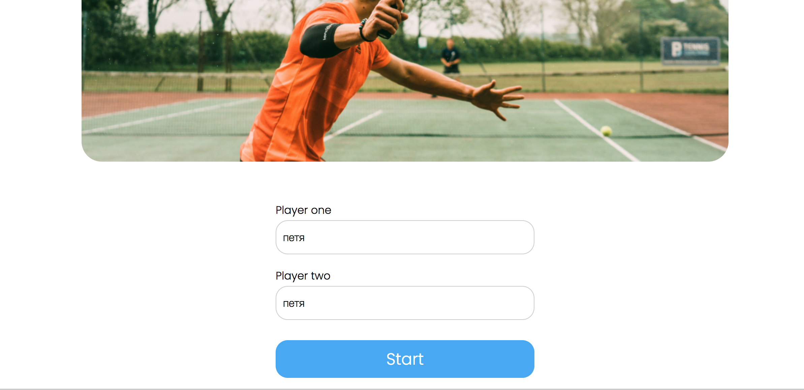
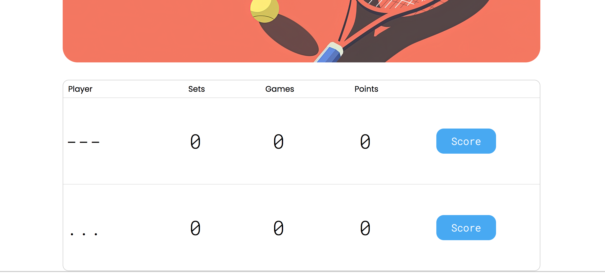
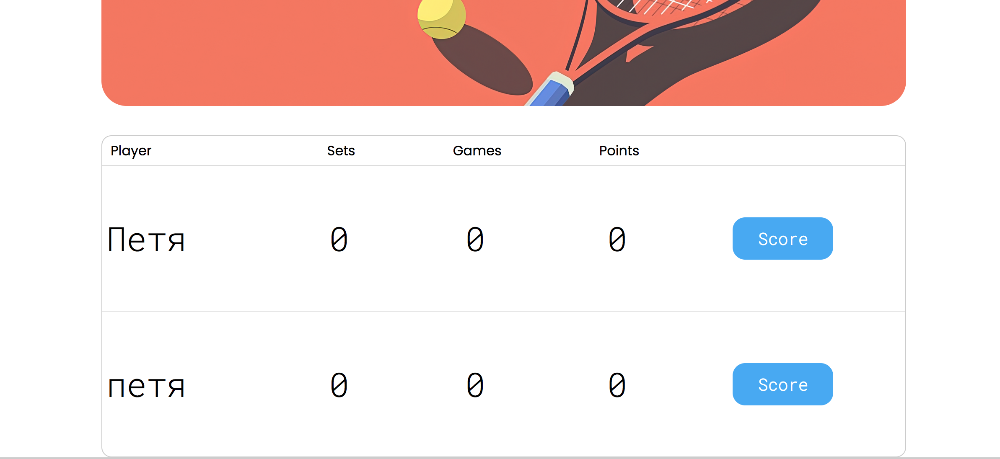
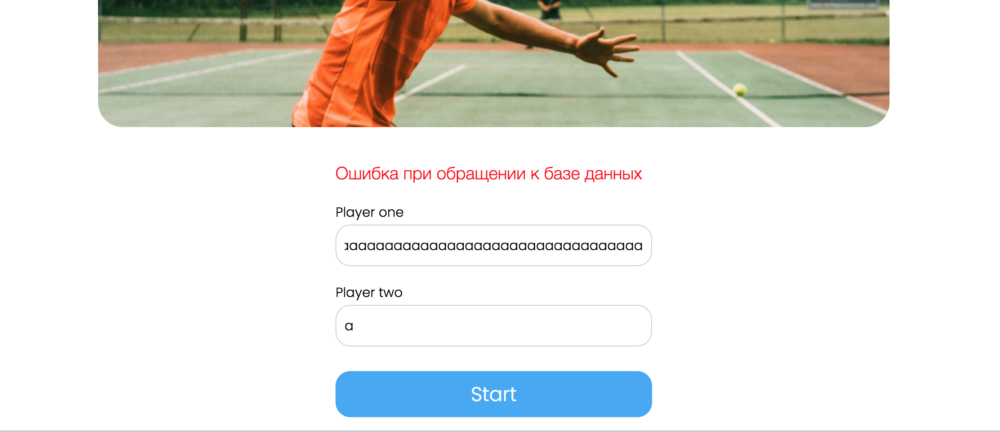

```text
Знаком ❗️ помечены критически важные замечания, а также места нарушения ТЗ.
```

## Функциональный обзор

- Сообщения об ошибке валидации имени сейчас не отображаются, поэтому пользователю не понятно, что происходит и визуально кажется, что не происходит вообще ничего:



- Сейчас можно создать игроков с такими именами:



Раз в проекте есть валидация, стоит добавить проверку, что в имени есть буквы и ввести другие уместные ограничения.

- ❗️Можно создать игроков с одинаковыми именами, если написать их в разном регистре:



Имя игрока должно быть уникальным без учёта регистра.

- ❗️Если ввести имя, превышающее допустимую длину, то пользователь увидит неинформативное сообщение:



Вместо этого стоит сообщать об ошибке валидации по длине.

