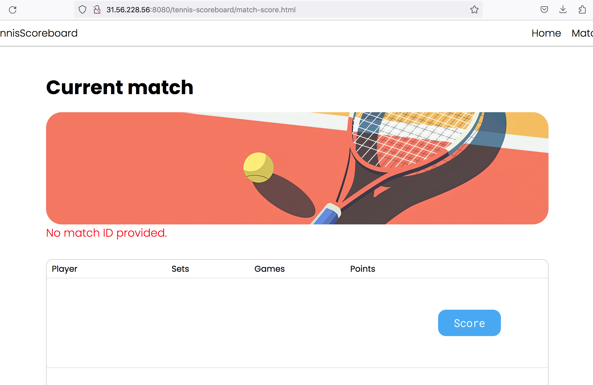

```text
Знаком ❗️ помечены критически важные замечания, а также места нарушения ТЗ.
```

## В целом по проекту

- 255 символов избыточно для имени игрока. Можно ввести более строгое ограничение.

- Во многих местах в коде оставлены комментарии, они отличаются по назначению и языку. 

Комментарии, которые не несут значимой смысловой нагрузки или просто описывают работу методов, не нужны. Стоит удалять их из всех классов перед коммитом.

- Сообщения в исключениях принято писать на английском языке. Если сообщения предназначены для пользователя, стоит использовать локализацию.

- Некоторые комментарии похожи на оставленные llm. Польза от учебного проекта будет больше, если не использовать нейросети при реализации значимых частей. Но даже если llm всё же используется, стоит переписывать предложенный ею код вручную.

- Можно заменить `UNIQUE` в DDL на явное создание индекса через `CREATE UNIQUE INDEX ...` в файле миграции и явно задать ему имя (чтобы оно совпадало с JPA).

- Можно дать файлам миграций более содержательные имена. Например, `V1__create_initial_schema.sql` или `V1__create_players_and_matches.sql` и `V2__seed_test_players_and_matches.sql` или `V2__seed_test_data.sql`

- ❗️В проекте есть Spring, но используются не все его преимущества. 

Например, Spring даёт аннотацию `@Transactional` для декларативного управления транзакциями. А также возможность автоматической трансляции исключений работы с БД.

Стоит перевести приложение на Spring-ориентированный подход и использовать подходящие преимущества этого фреймворка.

- Где-то числительные, обозначающие игроков, написаны цифрами (player1, player2), а где-то словами (firstPlayer, secondPlayer) — лучше выбрать один подход и во всём приложении использовать его.

- ❗️Сейчас HTML страницы находятся в `src/main/webapp/`. Это корневая директория веб-приложения, и любая страница в нём доступна по прямому URL.

Например, сейчас можно открыть http://31.56.228.56:8080/tennis-scoreboard/match-score.html и увидеть пустую страницу, предназначенную для текущего матча, котора должна быть доступна только при определённых условиях (когда матч создан).



View (страницы HTML) не должен быть доступен в обход Controller (сервлета), поэтому стоит поместить все HTML страницы внутрь `WEB-INF`.

